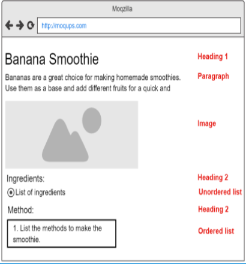
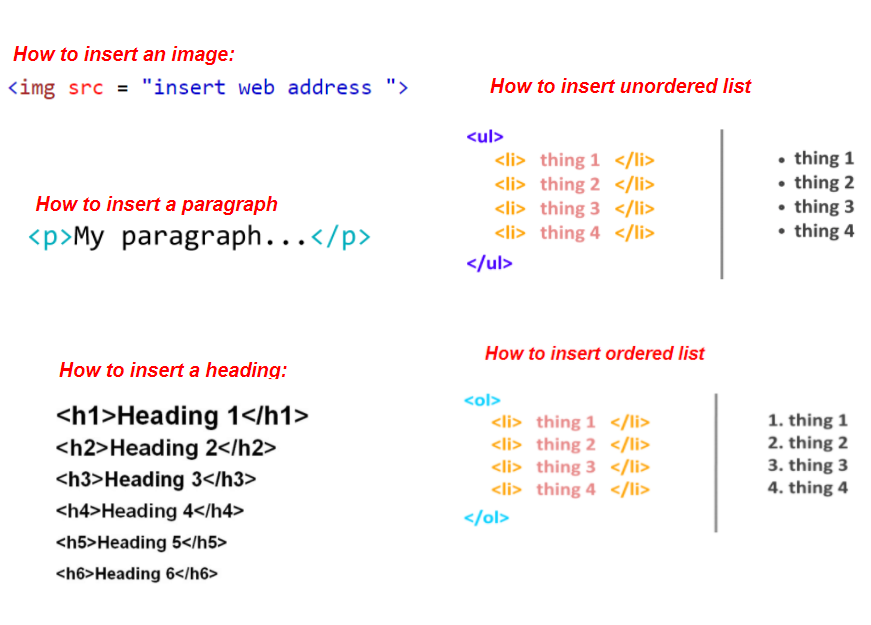
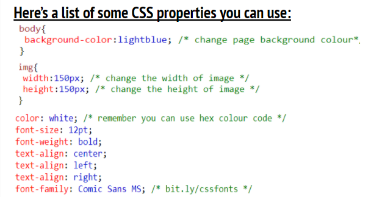
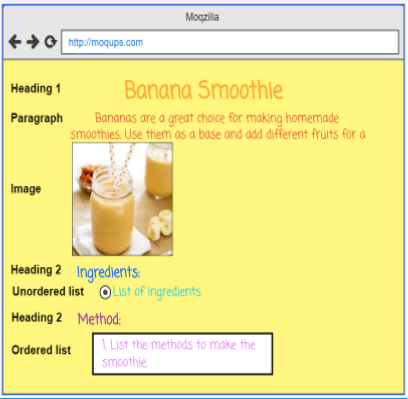

# 💻 Introduction to HTML and CSS 

You  will explore the two core languages that are used to build web pages; Hypertext Markup Language (HTML) and Cascading Style Sheets (CSS).

## ✅ Learning Outcomes: Exercise 1.1

> *By completing this exercise you will have experienced the following:*

* Format a webpage using appropriate CSS properties.
* Change the background colour of a page. 
* Change the height and width of an image. 
* Change font colour, size, weight, alignment and font family. 

---

## 🎯 Exercise 1.1:  Make a Recipe (HTML) 

* You will be introduced to your first 5 HTML tags; inserting an image, headings, paragraph, unordered lists and ordered lists. 

*  Using the **index.html** create your very own recipe card, **be creative it does not have to be a banana smoothie recipe** but it must match the **wireframe design below**. This points out the **HTML tags** the designer wishes for you to use.

**Use the HTML Code to help create your desired effect**

---
## ✅ Learning outcomes: Exercise 1.2

> *By completing this exercise learners will experience the following:*

* Display images within a web page.
* Display headings within a web page.
* Display paragraphs within a web page.
* Display unordered and ordered lists within a web page.
* Follow wireframe design and apply appropriate HTML tags.

## 🎯 Exercise 1.2:  Make a Recipe (CSS)
* You will be introduced to your first set of CSS properties; background color, image height and width, font color, size, weight, alignment and family. 

*  Now it is time to add to your **HTML recipe card** you created and format it using relevant CSS tags to achieve their desired effect. **Be creative** you must use at least one of each of the following **css propertie below**

**Use the CSS Code to help create your desired effect**

Your final webpage should look something like this:

